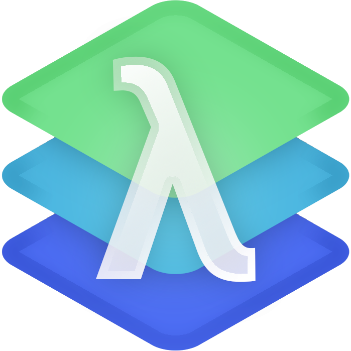

	
	
	
	
	
	   
	
	<h1 align="center">Concata</h1>
	
A stack-based concatenative functional programming language

	

		<a href="examples">Examples</a>
		.
		<a href="SPEC.md">Specification</a>
		·
		<a href="https://github.com/LordOfTrident/concata/issues">Report Bug</a>
		·
		<a href="https://github.com/LordOfTrident/concata/issues">Request Feature</a>
	

	 

	
Table of contents

	<ul>
		<li><a href="#introduction">Introduction</a></li>
		<li><a href="#examples">Examples</a></li>
		<li><a href="#specification">Specification</a></li>
		<li><a href="#bugs">Bugs</a></li>
	</ul>

> [!WARNING]
> This language is a **work-in-progress** and anything might change at any moment.

## Introduction
**Concata** is a general-purpose stack-based concatenative functional
programming language written in Nim. It takes inspiration from languages like
[Forth](https://en.wikipedia.org/wiki/Forth_(programming_language)),
[Joy](https://en.wikipedia.org/wiki/Joy_(programming_language))
and
[Elixir](https://en.wikipedia.org/wiki/Elixir_(programming_language)),
but also
[Nim](https://en.wikipedia.org/wiki/Elixir_(programming_language)).

## Examples
You can see example Concata programs in the [examples folder](examples)

## Specification
Concata has a
[work-in-progress specification](SPEC.md)
that you can read in it's current state.

## Bugs
If you find any bugs, please,
[create an issue and report them](https://github.com/LordOfTrident/concata/issues).

 
<h1></h1>
 

	
Made with ❤️ love

(<a href="#readme-top">Back to top</a>)

